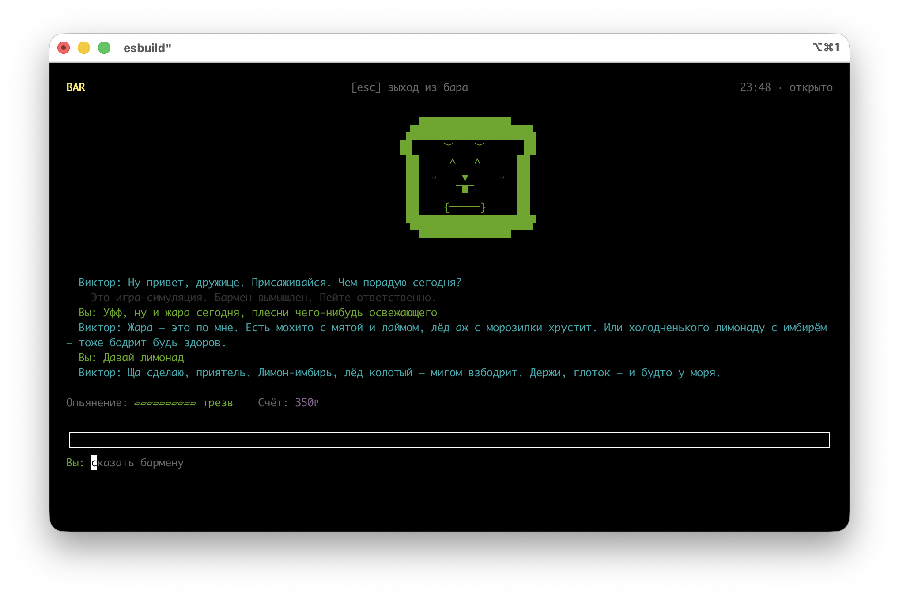

# bartender-agent · Бармен Виктор

> Терминальный **character-агент**: не ассистент, а персонаж. Садишься за стойку ночного бара, Виктор болтает, шутит, слушает, предлагает выпить и смешивает коктейли. По ходу разговора он читает, насколько ты подвыпил — и в нужный момент твёрдо режет алкоголь и вызывает такси. Никаких «как ИИ». Полный отыгрыш роли.

<div align="center">

<!-- Скриншот: положи файл в docs/screenshot.png (или замени путь/URL ниже).
     Рекомендация: тёмный фон терминала, шрифт-моноширинный, кадр с активным
     диалогом + меняющимся лицом. Размер ~1280×800, PNG. -->



*Виктор за стойкой. Лицо меняется от настроения.*

</div>

---

## Почему это интересно

- **🎭 Character agent, не чат-бот.** Модель работает в роли. Свободный текст стримится посимвольно как живая реплика, а структурированные данные (настроение, действие, оценка опьянения) приходят отдельным `tool_call`. Один ход — и реплика, и анимация.
- **😏 Реактивное ASCII-лицо.** 10 настроений собираются из слотов черт (брови, глаза, рот, щёки, акцентный цвет). Моргание и подёргивание бровей — на `useState` + `setInterval`.
- **🥃 Динамика опьянения.** Оценка из двух сигналов: как игрок **выглядит** по репликам (LLM) + сколько мы **насобирали** по выпитому с учётом метаболизма. Полоса опьянения и зоны поведения в реальном времени.
- **🚕 Твёрдые пороги.** При `drunkenness ≥ 7` редюсер **форсирует** отказ, даже если модель согласилась налить. Уговоры «ещё одну» не проходят — это game rule, а не просьба персонажа.
- **🔌 Провайдер-агностично.** Loop не знает, какой LLM за ним стоит. Контракт — `StreamEvent`. Поддерживаются Anthropic Claude, OpenAI/GPT и любой OpenAI-compatible эндпоинт (DeepSeek, локальные модели). BYOK — ключи пользователя, расходы на нём.
- **🧪 Предсказуемая логика.** Переходы состояния — чистая функция (`state/reducer.ts`), покрытая юнит-тестами. Сайд-эффекты (анимации, таймеры) живут отдельно, поверх редюсера.

## Превью

```
                      BAR · 23:47

                   ▄▄▄▄▄▄▄▄▄▄
                 ▟███████████████▙
                ██   ﹀   ﹀   ██      ← брови/глаза/рот — слоты,
                ██   ^   ^   ██        собираются под настроение
                ██      ▼    ██
                ██    ▔▀▔    ██
                ██  ｛═════｝ ██      ← усы. Визитная карточка.
                 ▜███████████████▛
                   ▀▀▀▀▀▀▀▀▀▀

 Виктор: Ну привет, дружище. Что пьём сегодня?
 >  налей мне что-нибудь покрепче
 Виктор: О, дела идут в гору. Делаю «Олд фэшнд»…
       ▒▒▒▒▒▒▒▒▒  (наливает)

 Опьянение: ▰▰▰▰░░░░░░  навеселе    Счёт: $24
 ─────────────────────────────────────────────
 Вы: ▮
```

## Установка

```bash
npm install -g bartender-agent
bartender
```

Нужен Node ≥ 18. Конфиг — в `~/.bartender-agent/.env` (ниже). Ключи нигде не логируются и не уходят в prompt/history.

```bash
mkdir -p ~/.bartender-agent
cat > ~/.bartender-agent/.env <<'EOF'
# Провайдер и модель (опционально — иначе выбор при старте)
BARTENDER_PROVIDER=opencode-go
BARTENDER_MODEL=deepseek-v4-pro

# Ключ хотя бы одного провайдера
OPENCODE_GO_API_KEY=...
# ANTHROPIC_API_KEY=...
# OPENAI_API_KEY=...
EOF
```

Переменные реального окружения (`export ...`) имеют приоритет над `.env` — удобно для CI/контейнеров.

## Из исходников (для разработки)

```bash
git clone https://github.com/kalyaganov/bartender-agent.git
cd bartender-agent
npm install
cp .env.example .env   # вписать API-ключ хотя бы одного провайдера
npm run dev
```

В дев-режиме env подгружается из CWD `.env` через `tsx --env-file=.env`.

### Провайдеры

| Id | Лейбл | Что нужно в `.env` |
|---|---|---|
| `opencode-go` | OpenCode Go (DeepSeek) — по умолчанию | `OPENCODE_GO_API_KEY` |
| `anthropic` | Anthropic (Claude) | `ANTHROPIC_API_KEY` |
| `openai` | OpenAI (GPT) | `OPENAI_API_KEY` |

Способы выбора (приоритет сверху):
1. `BARTENDER_PROVIDER` в `.env` — поверх всего.
2. Сохранённый выбор в `~/.bartender-agent/preferences.json` (после первого ручного выбора).
3. **Экран выбора при старте** — если провайдер не выбран и настроено больше одного (или ни одного).
4. Единственный настроенный провайдер выбирается автоматически.

Сменить в рантайме: `/settings` → «Провайдер LLM». Текущая беседа сохраняется.

## Команды и управление

| Команда / клавиша | Действие |
|---|---|
| `/menu` | Меню коктейлей |
| `/settings` | Настройки: сменить провайдера, перезапустить вечер, помощь, выход |
| `/help` | Подсказка по командам + дисклеймер |
| `/exit` | Выйти из бара (сразу, с прощальной репликой) |
| `/state` | Внутреннее состояние (debug) |
| `ESC` / `Ctrl+C` | Подтверждение выхода (ESC/Y/Enter — уйти, иная клавиша — остаться) |

Обычный текст — реплика бармену.

## Архитектура

```
src/
  agent/
    loop.ts          execution loop: стрим + диспетчер tool_call
    prompt.ts        system prompt + state snapshot
    tools.ts         инструмент bartender_action (JSON-схема)
    providers/       LLMProvider-контракт + адаптеры (anthropic, openai)
  state/
    reducer.ts       чистые переходы состояния (тестируется)
    drunkenness.ts   displayDrunkenness + метаболизм
    store.ts         zustand: единый источник правды для UI
  ui/
    Face.tsx         лицо: муд, моргание, подёргивание
    faces.ts         слоты черт → ASCII-арт по мудам
    DialoguePanel / CocktailAnimation / Meter / Tab / StatusBar / InputBox
  data/cocktails.ts  мини-БД коктейлей
```

**Поток одного хода:** игрок → `loop` → `provider.streamTurn()` → токены стримятся в стор → `tool_call` проходит через `reducer` → UI реагирует (лицо, анимация, метр, таб). Стор — единственный источник правды, компоненты только читают через хуки.

Подробно: [docs/BACKLOG.md](./docs/BACKLOG.md) — идеи, техдолг и спецификации. `docs/` — все планы и SPEC’и заводятся под фичу.

## Стек

TypeScript (strict) · Ink (React для CLI) · React 18 · zustand · zod · OpenAI-совместимый SDK · @anthropic-ai/sdk · vitest.

## Скрипты

```bash
npm run dev        # запуск с hot-reload (tsx watch)
npm start          # однократный запуск
npm run typecheck  # tsc --noEmit
npm test           # vitest
```

## Безопасность и этика

System prompt запрещает: поощрять вождение после выпивки, смешивать алкоголь с лекарствами, одобрять запой. При упоминании руля — настойчиво предлагать такси. Пороги опьянения **окончательные**: бармен не поддаётся на уговоры «ещё одну».

> Это игра-симуляция. Бармен вымышлен. Пейте ответственно.
